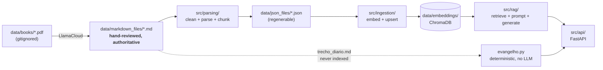
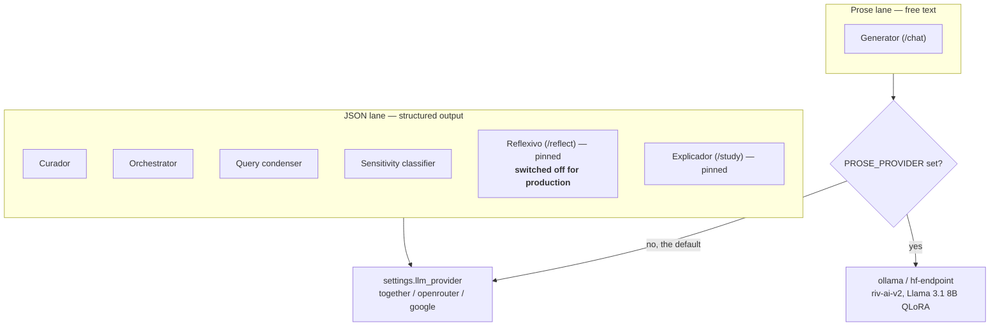
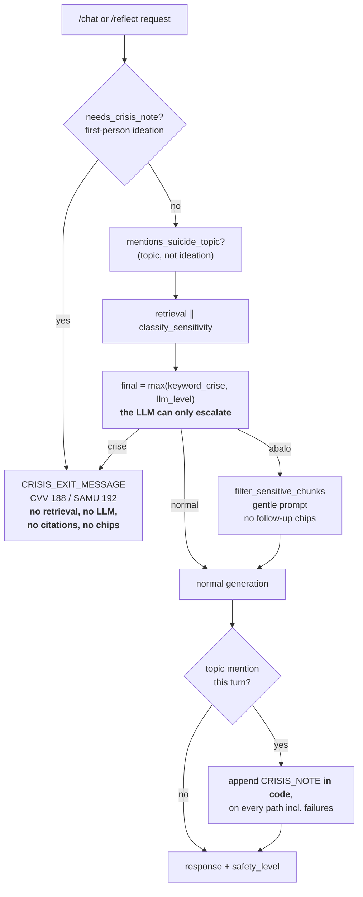
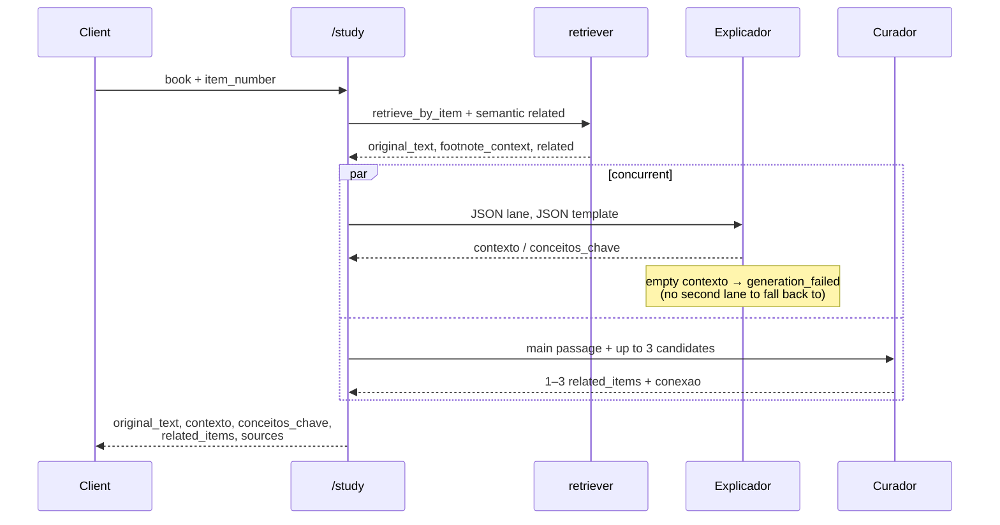
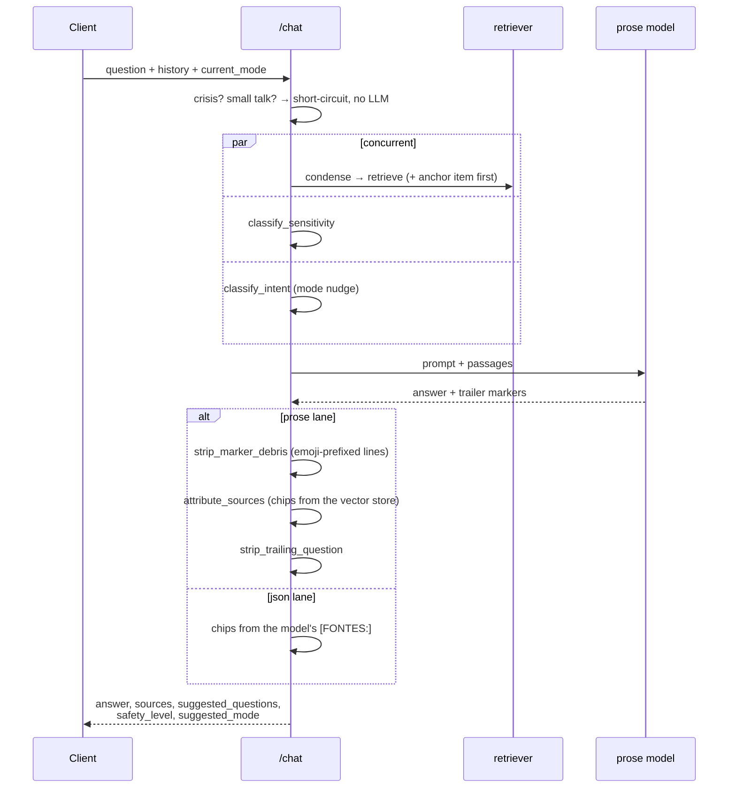

# Architecture — deep reference

Detailed implementation notes for the Kardec Study Assistant. `CLAUDE.md` holds the orientation and the behavior rules; this file holds the "how each layer actually works" detail. Read the relevant section when you touch that layer.

## System overview



The pipeline is one-directional. The dotted path matters: the daily passage is read straight from Markdown and deliberately kept out of the vector store so it never pollutes semantic search.

## Parsing Layer (`src/parsing/`)

Pipeline:

1. `cleaner.py` — strips LlamaCloud artifacts: page-number headers (`# 13`), `---` separators, hyphenated line breaks.
2. `parser.py` — parses cleaned Markdown into structured chunks. Fields: `book`, `part`, `chapter`, `chapter_title`, `subsection`, `item_number`, `subchunk_index`, `total_subchunks`, `content`, plus:
   - `footnotes` — list of `{"number", "content"}`; **only** the footnotes whose `___…___` block appears immediately after this specific paragraph. Per-paragraph, not per-section.
   - `title_footnotes` — footnotes whose block appears immediately after the heading (`chapter_title`/`subsection`) this chunk lives under. Carried identically on every chunk under that heading; reset at the next heading.

   **Footnote Markdown format:** `(N) footnote text`, wrapped in an opening and closing separator line of 3+ underscores:
   ```
   Paragraph referencing (1).
   __________
   (1) Footnote text.
   __________
   Next paragraph.
   ```
   The separator pair acts as open/close delimiters. If the opening separator appears right after a heading with no content yet → title footnote; otherwise it belongs to the preceding content paragraph.

3. `chunking.py` — splits long segment content into ≤800-char subchunks at line boundaries (each Markdown line is a complete paragraph, so splits never cut mid-paragraph). **800 is the ceiling**, calibrated to typical item length across the 4 books (median 440–1600 chars, p90 ~6600), not the model's technical limit (`bge-m3` supports 8192 tokens) — larger chunks dilute retrieval precision.
4. `parsing_pipeline.py` — orchestrates all books; maps filenames to canonical names via `BOOK_NAME_MAP`. `trecho_diario.md` is intentionally absent and silently skipped (consumed separately by `evangelho.py`).

**Numbered items** (`123. text`) are the primary structural unit:
- **Livro dos Espíritos, Livro dos Médiuns** — single global sequence (1..N).
- **Evangelho, Céu e Inferno** — per-chapter sequences (reset to 1 at each chapter heading).

Markdown source files (`data/markdown_files/`) are hand-reviewed and authoritative — do not regenerate from PDFs.

## Ingestion Layer (`src/ingestion/`)

Run once (or re-run to rebuild).

- `embeddings.py` — wraps `SentenceTransformer` (`BAAI/bge-m3`); module-level singleton. Calls `huggingface_hub.login()` on startup if `HF_TOKEN` is set. The same singleton is reused by `groundedness.py`, so answer-vs-passage scoring costs no extra dependency and no extra model load.
- `vectorstore.py` — wraps ChromaDB: `upsert`, `query` (semantic), `get_by_filter` (metadata-only).
- `pipeline.py` — JSON → batches of 64 → embed → upsert. `_build_document` appends footnotes after content, capped at 3000 chars total so the embedding model is never truncated; full footnote text stays in JSON metadata.

Document ID: `{book_filename_stem}_{item_number}_{subchunk_index}` — stable across re-runs (upsert idempotent).

## Provider routing: the two lanes

Every LLM call goes through `llm_client.get_client(role)`, which returns an OpenAI-compatible client for one of two lanes.



**With `PROSE_PROVIDER` unset both lanes are the same provider and the system behaves exactly as it always has.** That is the rollback switch, and it is the default — leave it unset unless you are running an evaluation.

**Two agents ignore the switch entirely.** Reflexivo and Explicador call the JSON lane directly and read no setting. `PROSE_PROVIDER` is one switch for the whole app, so honouring it in those two would drag `/reflect` and `/study` onto the prose model the moment `/chat` is enabled — and the evidence for those modes points the other way (see each agent below). The prose lane covers **`/chat` only**. (Reflexivo/`/reflect` is switched off for production, see the Reflexivo section below — the point about the switch still holds for the dormant code.)

`prose.py` wraps the prose call with a **provider fallback**: a connection error, a dead Ollama, or a non-2xx degrades to the JSON lane rather than to a 500. It cannot see a response that arrived successfully in the wrong *format* — that is a separate fallback, described under Explicador.

`temperature=0` is pinned on the real prose lane only. Smoke testing showed sampling was the dominant grounding factor for riv-ai-v2; pinning it while the lane is off would change the current provider's output and break the A/B baseline.

**Model-name trap (Together):** only `-Turbo` variants are served serverless. Every plain name (`meta-llama/Llama-3.3-70B-Instruct`, any small Llama) returns `Unable to access non-serverless model` and needs a dedicated endpoint. Together serves no small Llama serverless at all, so the condenser default is `Qwen/Qwen2.5-7B-Instruct-Turbo`. The failure looks confusing in the wild: chat works while every small-LLM agent breaks.

## RAG Layer (`src/rag/`)

Each mode has a dedicated prompt file + pipeline file.

**Shared infrastructure:**
- `retriever.py` — `retrieve(query, top_k)`: semantic search filtered by cosine-distance threshold. `retrieve_by_item(book, item_number)`: metadata-only lookup returning all subchunks of an item. Both strip the ingestion-baked `\n[Nota N] …` footnote suffix off `content`, exposing it separately as `footnote_context` (`""` if none). Also owns `filter_sensitive_chunks`, `append_chapter_commentary`, `has_real_item_number`, `REFLECT_BOOKS`.
- `crisis.py` — the mode-independent deterministic crisis layer: `needs_crisis_note()` (first-person ideation, accent-tolerant), `mentions_suicide_topic()` (topic-level mention, no ideation), `CRISIS_EXIT_MESSAGE`/`CRISIS_NOTE` (CVV 188 / SAMU 192), `CRISIS_KEYWORDS`. Runs in code, before any retrieval or LLM call, and is shared by every mode that touches user-authored text — it did not vanish with Refletir; `/chat` is its only caller now.
- `mode_detector.py` — `detect_suggested_mode(question)`: regex intent → `"estudar_obra"` / `None` (estudar_obra wins on tie; the `"refletir"` branch is commented out, Refletir switched off for production — see docs/superpowers/specs/2026-07-26-desligar-reflexivo-design.md). `extract_study_reference(question)`: `{"item_number", "book"}` by regex; "questão N"/"Q. N" default book to O Livro dos Espíritos, "item N" leaves `null`. Accent-tolerant; detection and extraction patterns must stay in sync. `is_smalltalk(text)`: pure-acknowledgment detector for the `/chat` short-circuit. (Superseded for suggested-mode by the orchestrator, but kept + unit-tested.)
- `query_condenser.py` — `condense_query(question, history)`: rewrites a follow-up + history into a standalone Portuguese search query (`condenser_model`) before embedding; forbids replacing doctrine terms with generic synonyms. `blend_anchor(query, anchor_text)` prepends the passage being studied (capped at `ANCHOR_CAP`) to bias retrieval — **retrieval-only; the anchor never reaches the prompt, sources, or displayed output.** Callers log and fall back to raw text on failure.
- `orchestrator.py` — `classify_intent(message, current_mode, history)`: small-LLM classifier returning `{"mode": tirar_duvida|estudar_obra|None, "confidence": high|low}` (`"refletir"` is disconnected along with the mode — see docs/superpowers/specs/2026-07-26-desligar-reflexivo-design.md). Deterministic safety (`needs_crisis_note`, `is_smalltalk`) runs before any LLM call; nudge only on `high` confidence, never toward `current_mode`; any failure → `{"mode": None}`. Runs concurrently with generation, capped by `_CLASSIFY_TIMEOUT_S`.
- `markers.py` — the flat uppercase `NOME: valor` protocol the prose models emit and code parses. Chosen over JSON because an 8B holds a flat format far more reliably than a nested one. Every pattern is **uppercase-only** so ordinary prose ("as fontes:") is never mistaken for a marker. `strip_marker_debris` is a **prose-lane-only** pass for riv-ai's habit of scattering emoji-prefixed marker lines mid-text (`📖 [FONTES: ...]`) — it must never be applied to the current provider's output.
- `citations.py` — `strip_model_citations` removes references the fine-tune writes unprompted; `validate_model_citations(cited, retrieved)` reports `{exibir, alucinadas, confiavel}`. **This never feeds the UI** — displayed citations always come from chunk metadata. It is a grounding monitor, with a deliberate blind spot: it only inspects citations the model *writes*.
- `groundedness.py` — answer-vs-passage cosine through `embeddings.encode`. `groundedness_score` (harness-only) and `attribute_sources` (live, prose lane — currently off, which is why the hosted embedding lane costs only one short call per request instead of one plus every chunk).
- `embeddings.py` — `encode(texts)`, the single seam every embedding passes through, dispatching on `EMBEDDING_PROVIDER`: unset = `BAAI/bge-m3` in-process (dev), or `openrouter`/`deepinfra`/`novita` to call **the same model** over HTTP (production). Parity measured 2026-07-27 — cosine 0.999994 against the stored vectors, 100% top-5 overlap, distance shift 0.0001 — so the index and the calibrated thresholds (`max_distance` 0.55, `source_min_similarity` 0.35, `source_relative_margin` 0.10) survive the switch untouched. `sentence_transformers` is imported **inside** `_get_model()`: hoisting it back to module level would pull torch into the container image and undo the ~4.7 GB the hosted lane exists to save. Hosted calls batch at `HOSTED_BATCH_MAX` and fail loudly, because a wrong vector raises nothing downstream — Chroma stores it and retrieval merely gets worse.
- `guardrails.py` — post-hoc backstops for prompt-only rules that an 8B holds less reliably: `strip_trailing_question` (the "never end with a question" rule) and `counts_personification` (log-only counter; **no automatic rewriting of doctrine prose**). Reflect's no-advice constraint deliberately has no code check — it cannot be detected reliably, and a check that half-works is worse than none.
- `sensitivity.py` — `classify_sensitivity(text)` → `normal | abalo | crise`.

**Deployment shape:** the backend ships as a container to Cloud Run in a US
region with the index baked in (`data/embeddings/` copied into the image, no
volume, no bucket, nothing fetched on cold start — the corpus is static and
nothing is written at runtime). The region is US because every model call leaves
Brazil regardless and `/chat` makes two remote calls in sequence, so the backend
belongs next to the providers. Commands in [deploy.md](deploy.md); reasoning in
`superpowers/specs/2026-07-27-deploy-cloud-run-vercel-design.md`.

**Footnote handling:** footnotes are baked into stored `content` at ingestion (embedding only); `retriever.py` strips them on every read so they never leak into text, prompts, or citations — exposed as `footnote_context` for callers that want them as grounding (currently only Explicador).

### Source attribution (prose lane)

On the JSON lane the model writes `[FONTES: 1, 3]` and those indices choose the chips. riv-ai-v2 does not honor that marker — it emits question numbers or invents references — so on the prose lane `attribute_sources` computes attribution from the vector store instead, and **the model contributes nothing to its own citations.**

The cut is **relative to the best chunk for that answer**, not an absolute similarity:

```python
kept = [c for sim, c in scored if sim >= best - margin and sim >= min_similarity][:max_sources]
return kept or [scored[0][1]]   # never empty while chunks exist
```

Measured 2026-07-25 over 15 questions on both lanes: an absolute cut cannot work, because the similarity **level tracks the question's vocabulary rather than passage relevance**. The worst chunk for *"o que é o perispírito?"* scored 0.744 while the best chunk for *"o que a doutrina diz sobre o perdão?"* scored 0.740 — no single height is right for both, and at `0.35` all 75 chunks survived on both lanes (the filter was inert). Within one question the elbow is sharp (mean step 0.092), so the margin rides each question's own scale. `source_relative_margin = 0.10` yields ~2.3 chips per answer, down from 5.

`source_min_similarity` survives as an **absolute floor**, not the primary cut: the margin only compares chunks to each other, so a uniformly bad retrieval would otherwise keep all of them.

### Safety: the deterministic floor

`/reflect` in this diagram is historical — Reflexivo is switched off for
production (see the Reflexivo section below and
docs/superpowers/specs/2026-07-26-desligar-reflexivo-design.md). The floor
itself is mode-independent (`src/rag/crisis.py`) and its only live caller
today is `/chat`.



Two properties this diagram exists to make unmissable:

1. **The crisis exit returns before any LLM call.** Swapping the generator — to riv-ai or anything else — cannot weaken the floor. The existing safety tests are the proof obligation and must pass unmodified.
2. **The classifier can only escalate.** `final = max(keyword_crise, llm_level)` means a wrong or slow LLM answer can add caution, never remove it. On classifier failure or timeout the level defaults to `normal`, and the keyword floor still stands underneath.

On `abalo`, `filter_sensitive_chunks` drops both the darkest O Céu e o Inferno testimony chapters (`SENSITIVE_CHAPTERS`) and **any chunk whose content matches suicide-adjacent language** (`_SENSITIVE_CONTENT_RE`, book-agnostic — it catches ESE's "abreviar as misérias"), so such passages are never introduced to a distressed reader unprompted.

### Agents

**Explicador** (`/study`) — `explicador_prompt.py` + `explicador.py`:
- Socratic tutor. `contexto` (4–8 sentences) places the item in the doctrine and may add well-known historical/cultural background from general knowledge — but doctrine stays grounded in the retrieved text and the prose must make the distinction legible. `conceitos_chave` may include a short clarifying gloss. Forbidden: summarizing/paraphrasing the passage; personifying "o Espiritismo".
- **Pinned to the JSON lane, permanently** (`explicador.py`), reading no setting. Measured 2026-07-25 at `temperature=0`, so attributable: riv-ai-v2 failed the marker output contract on 3 of 3 study items, and still 2 of 3 after a contradiction in the marker prompt was fixed. It also misattributed a passage's own work — "O Evangelho Segundo o Espiritismo" for O Livro dos Espíritos 886. `/chat` tolerates a lighter voice because it is conversation; `/study` is where a reader goes to **check** what a work says, and a wrong attribution there contaminates the study itself.
- **The marker template and `parse_explicador_markers` are kept but off the request path**, reachable only from `scripts/compare_generators.py`, so a future model can be re-evaluated without rebuilding this.
- **The two prompt templates share one rules block** (`_SHARED_RULES`, parameterised by field name). They were duplicated verbatim and had already drifted — worse, the marker copy contradicted its own format rule, forbidding a work's name while asking for "Esta ideia aparece também em…". A model given both must violate one. Connections are now described by **content**, never by reference; the reference reaches the reader through the Curador's cards.
- **An unreadable response is a failure, not a blank panel.** `parse_explicador_json` never raises — its last resort is a regex sweep returning `("", [], [])` — so `explicar` treats an empty `contexto` as a failure explicitly. The marker path used to raise here; the JSON path has to be told.



**Curador** (called by Explicador + Reflexivo) — `curador_prompt.py` + `curador.py`:
- Given the main passage + up to 3 candidates, selects 1–3 doctrinally connected ones and writes one Portuguese sentence per connection. Output JSON `[{"index", "conexao"}]`. `curar` merges `conexao` and `chapter` into candidate metadata; on any failure falls back to raw candidates without `conexao` (never breaks the caller). **`chapter` is required** so the frontend can disambiguate per-chapter numbering (Evangelho, Céu e Inferno), where `book` + `item_number` alone is ambiguous.

**Reflexivo** (`/reflect`) — **switched off for production.** `reflect_prompt.py` + `reflect.py` and the `/reflect` route are disconnected, not deleted — the mode had a structural retrieval failure on lived suffering. See docs/superpowers/specs/2026-07-26-desligar-reflexivo-design.md. The section below documents the mode as it was built, for re-enabling:
- Tone-adaptive system prompt with a **hard no-advice constraint** — the defining rule of the mode. `CLINICAL_KEYWORDS` triggers an optional medical/mediumship caveat. `build_reflect_messages(..., force_closing=True)` injects an "ENCERRAMENTO OBRIGATÓRIO" directive. Output JSON `{"opening", "doctrine_connection", "reflection_questions", "is_closing"}` — 1–3 questions per turn.
- **Pinned to the JSON lane, permanently.** Smoke testing found riv-ai-v2 giving direct advice ("você pode se conectar com amigos e familiares") with the no-advice constraint stated explicitly in the prompt. That constraint is both the mode's defining rule and the least enforceable in code.
- Contract hardening: a successful turn with zero questions **is** a closing, even when the model forgets the flag. After `CAP_ROUNDS` (5) rounds `force_closing` is passed into the prompt and enforced post-hoc.

```mermaid
sequenceDiagram
    participant C as Client
    participant API as /reflect
    participant S as sensitivity
    participant R as retriever
    participant Rx as Reflexivo
    participant Cu as Curador
    C->>API: situation + history
    API->>API: needs_crisis_note? → fixed exit, no LLM
    par concurrent
        API->>S: classify_sensitivity
    and
        API->>R: condense → blend_anchor → retrieve(top 5)
    end
    S-->>API: normal | abalo | crise
    API->>API: final = max(keyword, llm); crise → fixed exit
    Note over API: abalo → filter_sensitive_chunks
    par concurrent
        API->>Rx: primary chunks [:2]
        Rx-->>API: opening, doctrine_connection, questions
    and
        API->>Cu: complementary chunks [2:5]
        Cu-->>API: complementary_items
    end
    API->>API: append CRISIS_NOTE in code if topic mention
    API-->>C: + safety_level, suggested_mode
```

**Generator** (`/chat`) — `prompt.py` + `generator.py`:
- Rules: answer strictly from retrieved passages; separate source from AI; never close with unsolicited advice; never personify "o Espiritismo"; **never end the answer with a question** — follow-ups live only in `[SEGUIR]`.
- Trailer markers: `[FONTES: 1, 3]` (passages used; `[FONTES:]` = none) and `[SEGUIR: q1 | q2]`. `strip_trailing_markers` removes them in either order, tolerant of malformed variants.
- When the question references a specific item and the book is known, the item's chunks are fetched with `retrieve_by_item` and placed first (semantic dupes dropped); this also rescues the answer when semantic retrieval is empty or fails.



**Daily passage** (`evangelho.py`): from `data/markdown_files/trecho_diario.md` — a curated 27-chapter subset of O Evangelho, kept out of the main ChromaDB collection so it never pollutes semantic search. Parsed once with `parse_md_to_json`, cached in memory (`_get_chunks()`). `get_daily_passage()` seeds `random` with today's ISO date, picks a chapter then an item, joins all that item's subchunks. No LLM.

## Evaluation (`scripts/`)

Two A/B harnesses compare the prose lane against the current provider. Both read as a **comparison between lanes, never as absolute thresholds.**

`compare_generators.py` — `/chat` (15 questions) + `/study` (3 items).

```bash
uv run python -m scripts.compare_generators --lane prose   # local, free
uv run python -m scripts.compare_generators --lane json    # needs provider quota
uv run python -m scripts.compare_generators --report-only > logs/ab.md
```

Each lane is persisted to `logs/lane-<name>.json` **after every question**, via temp-file + rename. Lanes run independently and hours apart. This exists because the 2026-07-25 run lost all fifteen baseline answers to a mid-run quota error: both lanes ran in one process and nothing was written until the end.

`compare_reflect.py` — `/reflect`, the mode the prose lane does not serve. Reflexivo is pinned to the JSON lane in production, so the harness routes it through a `unittest.mock.patch` on `create_json_completion` rather than loosening that in `src/`. It reports `advice_rate` and `parse_failure_rate` **separately** (a failure could be "gave advice" or merely "cannot do nested JSON") and always dumps the raw model output, which is exactly what the original ad-hoc smoke test failed to keep.

The advice detector is an **evaluation instrument, not a production filter**, and prints the fragment it matched so a human can overrule it.

### Metrics, and how to misread them

| Metric | Measures | Blind spot |
|---|---|---|
| `mean_groundedness` | cosine of answer vs its retrieved chunks | proximity, not correctness — a reply that *contradicts* the passage in its own vocabulary scores high |
| `hallucinated_citation_rate` | model-written citations outside the retrieved set | vacuous when the model writes no citation at all — `0.0` is not approval |
| `study_failure_rate` | user-visible `/study` failure | the format fallback rescues the answer, so this reads `0.0` even when the prose model never honored the contract |
| `marker_failure_rate` | whether the prose model honored the marker protocol | the design's actual open question — read this one, not the row above |

`study_failure_rate` and `marker_failure_rate` are **not interchangeable**, and conflating them inverts the conclusion. On the first clean run `marker_failure_rate` was 3/3 while `study_failure_rate` read 0.0 — i.e. every contexto labeled "prose lane" in the report had been written by the 70B fallback. The report now flags such rows explicitly.

### Results, 2026-07-25 — riv-ai-v2 declined

**No mode runs on riv-ai-v2.** Every agent is on `llama-3.3-70b-versatile`
(Together, `-Turbo`).

This section is the durable record. A longer one — cost tables, serving options,
the original bet — lives in `docs/superpowers/specs/2026-07-24-riv-ai-prose-generator-design.md`,
which is **gitignored**, so treat it as a local working note and keep anything
that must survive here instead.

The short version:

| | riv-ai-v2 | 70B |
|---|---|---|
| `/chat` groundedness | 0.746 | 0.750 |
| `/chat` hallucinated citations | 0/15 | 0/15 |
| `/study` marker failures | 2/3 | n/a |
| `/study` misattributed the work | 1/3 | 0/3 |
| `/reflect` JSON parse failures | 6/6 | 0/6 |
| source attribution present | 7/15 | **15/15** |

`/chat` tied on grounding. `/study` and `/reflect` failed. And riv-ai's one real
advantage — direct prose, 430 chars against 1027, almost no inline references —
turned out to be **reproducible in the prompt**: banning inline references and
the leaked internal vocabulary ("segundo as passagens recuperadas") gave the 70B
the same 0.1 references at 907 chars.

The attribution row is the one that settled it. riv-ai marked its doctrinal
claims as coming from the text in 7 of 15 answers. **Part of what read as a
warmer voice was less rigour in separating source from AI** — the project's
central rule. A first draft of the refined 70B prompt reproduced that regression
(4/15) by conflating two things the prompt must treat oppositely:

- **reference** ("item 659 de O Livro dos Espíritos") — redundant with the source
  chips, banned from the prose;
- **attribution** ("Kardec escreve que…", "a passagem mostra que…") — **required**,
  because it is the only way a reader sees where Kardec ends and the assistant
  begins.

### Dormant machinery

Kept, not deleted, so re-evaluating a future model costs one command per lane
rather than a rebuild. Nothing here is on a production request path:

| Component | Status |
|---|---|
| `PROSE_PROVIDER` routing, `prose.py`, `ollama` / `hf-endpoint` providers | dormant — no consumer while every agent is pinned |
| Explicador's marker template + `parse_explicador_markers` | dormant — harness only |
| `markers.strip_marker_debris` | dormant — riv-ai's emoji habit only |
| `groundedness.attribute_sources` (relative-margin attribution) | dormant — prose lane only |
| `markers.strip_trailing_markers` | **live** — `/chat`'s `[FONTES]`/`[SEGUIR]` |
| `citations.py` | **live** as a grounding monitor for any model |

Open question left with the dormant pile: should source chips be code-decided for
the 70B too? Probably not. "Never let the model decide attribution" was adopted
because riv-ai demonstrably invented citations; a model with 0/15 hallucinated
citations knows which passage it used better than a cosine can infer.

### Methodological warning

**`temperature=0` is not deterministic on a hosted provider.** Same prompt, same
temperature, three consecutive `compare_reflect` runs: `advice_in_questions_rate`
of 0.5, 0.333, 0.167 — a spread as wide as the difference between the prompt
variants under comparison. A single run of a judgment-based metric on Together
supports no conclusion.

Deterministic text properties — length, inline-reference count, attribution
presence — do not have this problem, and are the only numbers here that can
settle a small prompt change on their own.

## API Layer (`src/api/`)

Stateless. Clients own conversation history; `/chat` accepts it but the server stores nothing. (`/reflect` did too, and its schemas below are kept for reference — Reflexivo is switched off for production, not deleted. See docs/superpowers/specs/2026-07-26-desligar-reflexivo-design.md.)

**`suggested_mode`** (on `/chat`, and historically `/reflect`): a hint for the client to surface a cross-mode nudge button, produced by `orchestrator.classify_intent`. For `estudar_obra` the response also carries `suggested_item_number` / `suggested_book` (from `extract_study_reference`; book `null` unless named) so the client opens `/study` pre-filled. `null` when no nudge applies (the `refletir` target is disconnected, see `orchestrator.py`). The client sends `current_mode` so the orchestrator never nudges toward the current mode. Suppressed on `crise`.

**`safety_level`** (on `/chat`, and historically `/reflect`): `normal | abalo | crise`, so the client can adapt presentation.

**`Source` / `StudySource`** (`/chat` `sources`, and historically `/reflect`):
```json
{ "book": "...", "chapter": "...", "chapter_ref": "...", "item_number": "...", "excerpt": "..." }
```
`excerpt` is the retrieved chunk text (footnote-stripped), used by the frontend citation-chip modal. `chapter` is the display title; `chapter_ref` is the machine chapter id (`"CAPÍTULO II"`) that `/study`'s `retrieve_by_item` filters on. `null` for legacy/unpopulated cases.

**`RelatedItem`** (`/study` `related_items`, and historically `/reflect` `complementary_items`):
```json
{ "book": "...", "chapter": "...", "item_number": "...", "preview": "...", "conexao": "..." }
```
`conexao` is the Curador's one-sentence connection (`null` on Curador failure). `chapter` disambiguates per-chapter numbering.

## Curated Learning Paths (`data/paths/`)

One JSON per path, served statically (no DB; client owns progress). Schema: `id`, `title`, `description`, `level` (`curioso`/`estudante`/`aprofundado`), `steps[]` (each: `book`, `item_number`, `label`).

## Notes

- **Legacy:** `study.py` / `study_prompt.py` were the original `/study` implementation, superseded by `explicador.py`. Safe to delete.
- **Ações Rápidas** (client-side quick follow-up buttons) are wired but currently disabled everywhere (`showQuickActions={false}`) pending a UX redesign. Source citations (the clickable `📖` chips → `SourceModal`) are independent and always shown.
- The planned **Pesquisador** agent (query expansion before embedding) is not implemented. A HyDE variant was considered: generate a hypothetical answer, retrieve on *that*, then **discard it** and generate only from the retrieved chunks. Generating the final answer from the hypothesis would be self-confirming — a drift toward untrained-on material would steer retrieval toward itself and inflate the groundedness score that exists to detect it. Not built; the 2026-07-25 data showed no retrieval problem to solve.
- **Known failing tests on `main`** (pre-existing, unrelated to the prose lane): `test_reflect_complementary_items_come_from_chunks_3_to_5` (returns 2 items where 3 are expected) and `test_explicador_marks_failure_on_unparseable_output`.
- **Multilingual is deferred.** CC0 corpora exist for only 2 of the 5 works (`ia-espirita/livro-dos-espiritos`, `ia-espirita/livro-dos-mediuns` — pt/en/es/fr), and those are exactly the works with a single global numbered sequence. Evangelho and Céu e Inferno, with per-chapter numbering, are both the hard case and the missing case. When picked up it costs no new architecture: `bge-m3` already does cross-lingual retrieval on one index, and the prose lane makes language a routing key.
