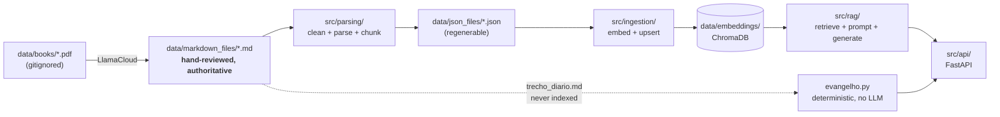
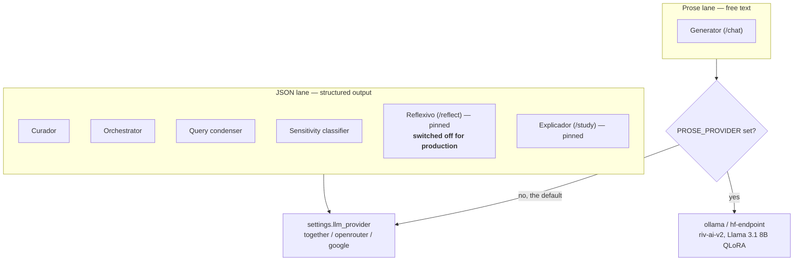
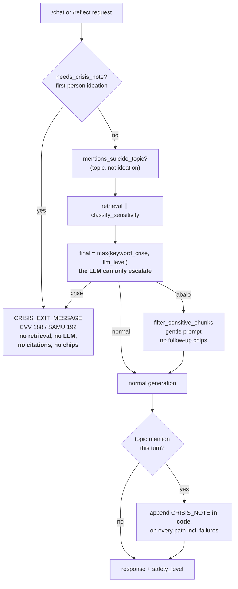
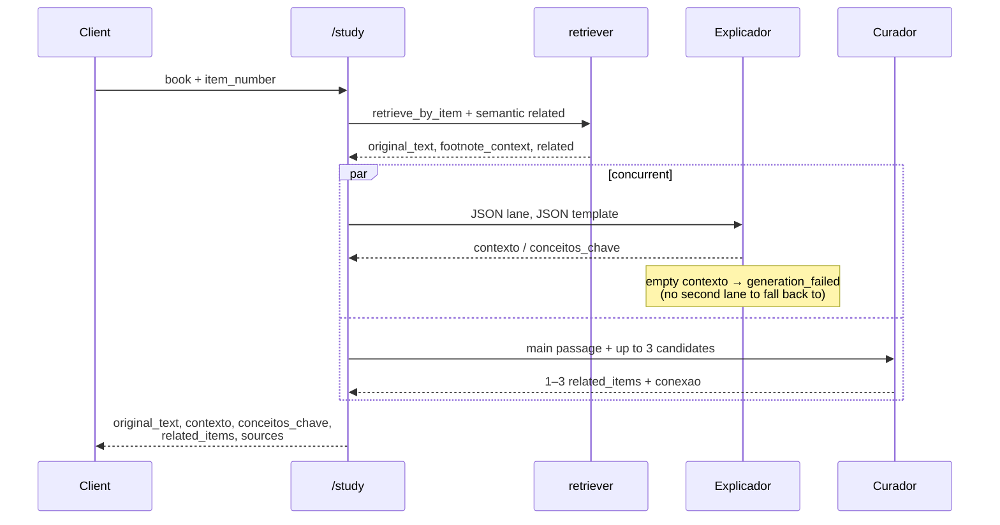
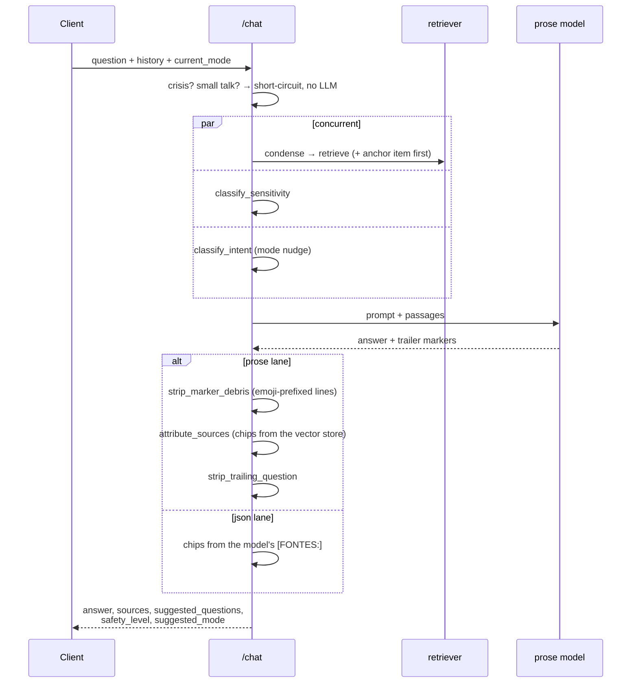

# Architecture — deep reference

Detailed implementation notes for the Kardec Study Assistant. `CLAUDE.md` holds the orientation and the behavior rules; this file holds the "how each layer actually works" detail. Read the relevant section when you touch that layer.

## System overview



The pipeline is one-directional. The dotted path matters: the daily passage is read straight from Markdown and deliberately kept out of the vector store so it never pollutes semantic search.

## Parsing Layer (`src/parsing/`)

Pipeline:

1. `cleaner.py` — strips LlamaCloud artifacts: page-number headers (`# 13`), `---` separators, hyphenated line breaks.
2. `parser.py` — parses cleaned Markdown into structured chunks. Fields: `book`, `part`, `chapter`, `chapter_title`, `subsection`, `item_number`, `subchunk_index`, `total_subchunks`, `content`, plus:
   - `footnotes` — list of `{"number", "content"}`; **only** the footnotes whose `___…___` block appears immediately after this specific paragraph. Per-paragraph, not per-section.
   - `title_footnotes` — footnotes whose block appears immediately after the heading (`chapter_title`/`subsection`) this chunk lives under. Carried identically on every chunk under that heading; reset at the next heading.

   **Footnote Markdown format:** `(N) footnote text`, wrapped in an opening and closing separator line of 3+ underscores:
   ```
   Paragraph referencing (1).
   __________
   (1) Footnote text.
   __________
   Next paragraph.
   ```
   The separator pair acts as open/close delimiters. If the opening separator appears right after a heading with no content yet → title footnote; otherwise it belongs to the preceding content paragraph.

3. `chunking.py` — splits long segment content into ≤800-char subchunks at line boundaries. **800 is the ceiling**, calibrated to typical item length across the five works (median 440–1600 chars, p90 ~6600), not the model's technical limit (`bge-m3` supports 8192 tokens) — larger chunks dilute retrieval precision.

   Two properties of the split are load-bearing downstream, and both have their own CLAUDE.md rule:
   - **A period only closes a sentence when the token it closes is a word.** `_closes_a_sentence` suppresses the boundary after a single letter (`S.` for São, the initials in `A. Kardec`, the `P.`/`R.` that open every line of the O Céu e o Inferno evocations) and after the measured citation abbreviations (`cap.`, `vv.`, `pág.`, `Art.`, …). The list was built by counting what precedes every candidate boundary in the corpus, not from intuition. `etc.` is excluded deliberately (it ends a sentence about as often as not), and numbers are excluded because `1857.` really does end sentences.
   - **A split is not always a paragraph break.** 28% of subchunk boundaries fall *inside* a source paragraph (measured 2026-08-02), and nothing in the text distinguishes those from a real break — so the splitter records `starts_paragraph` on every chunk, ingestion carries it into the metadata, and `join_item_text` is the only thing allowed to rejoin them. See "Rejoining an item for reading" below.
4. `parsing_pipeline.py` — orchestrates all books; maps filenames to canonical names via `BOOK_NAME_MAP`. `trecho_diario.md` is intentionally absent and silently skipped (consumed separately by `evangelho.py`).

**Numbered items** (`123. text`) are the primary structural unit:
- **O Livro dos Espíritos, O Livro dos Médiuns** — single global sequence (1..N).
- **O Evangelho, O Céu e o Inferno, A Gênese** — per-chapter sequences (reset to 1 at each chapter heading). O Céu e o Inferno restarts them again per *part*: "CAPÍTULO I" item 1 is `O PORVIR E O NADA` in I PARTE and `O PASSAMENTO` in II PARTE.

**A Gênese belongs in the second group, and is the easiest to get wrong** — it reads like a treatise rather than a numbered catechism, so it gets filed with the first group by intuition. Counted over `data/json_files/`, **67 of its 69 item numbers occur in more than one chapter** — proportionally the most per-chapter of any of the five works:

| Book | items | item numbers reused across chapters |
|---|---|---|
| A Gênese | 69 | **67** |
| O Evangelho | 92 | 31 |
| O Céu e o Inferno | 120 | 23 |
| O Livro dos Espíritos | 1047 | 0 |
| O Livro dos Médiuns | 392 | 0 |

Hence the rule in CLAUDE.md: **a passage is identified by `(book, chapter, item_number)`, never by `book` + `item_number`.**

Markdown source files (`data/markdown_files/`) are hand-reviewed and authoritative — do not regenerate from PDFs.

## Ingestion Layer (`src/ingestion/`)

Run once (or re-run to rebuild).

- `embeddings.py` — `encode(texts)`, the single seam every embedding passes through, dispatching on `EMBEDDING_PROVIDER`. Detail under the RAG layer below; the one thing to know here is that **`sentence_transformers` is imported inside `_get_model()`, never at module level** — hoisting it pulls torch into the container image and undoes the ~4.7 GB the hosted lane exists to save. `groundedness.py` goes through the same seam, so answer-vs-passage scoring costs no extra dependency.
- `vectorstore.py` — wraps ChromaDB: `upsert`, `query` (semantic), `get_by_filter` (metadata-only).
- `pipeline.py` — JSON → batches of 64 → embed → upsert. `_build_document` appends footnotes after content, capped at 3000 chars total so the embedding model is never truncated; full footnote text stays in JSON metadata.

### The document ID is the collision key

`_build_id` (`pipeline.py`) returns `{stem}_{part}_{chapter}_{item_number}_{subchunk_index}`, with `part` folded in only when the book has one:

```python
prefix = f"{stem}_{part}" if part else stem
return f"{prefix}_{chapter}_{chunk['item_number']}_{chunk['subchunk_index']}"
```

**Every component before `item_number` is there because something collided without it.** `upsert` treats a collision as an update, so a too-short key does not raise — it silently overwrites. Dropping `chapter` merges the per-chapter books above; dropping `part` merges O Céu e o Inferno's two "CAPÍTULO I"s, which cost **20 chunks of the production index** until 2026-07-29.

`part` is omitted rather than folded in as a blank field so the books that carry none (O Livro dos Espíritos, O Livro dos Médiuns) keep the ids they already have, and re-ingestion updates their rows instead of writing a second copy beside them.

**Changing this key requires rebuilding the index from empty** — re-ingesting over it leaves the old rows behind as orphans, and they are indistinguishable from live ones.

## Provider routing: the two lanes

Every LLM call goes through `llm_client.get_client(role)`, which returns an OpenAI-compatible client for one of two lanes.



**With `PROSE_PROVIDER` unset both lanes are the same provider and the system behaves exactly as it always has.** That is the rollback switch, and it is the default — leave it unset unless you are running an evaluation.

**Two agents ignore the switch entirely.** Reflexivo and Explicador call the JSON lane directly and read no setting. `PROSE_PROVIDER` is one switch for the whole app, so honouring it in those two would drag `/reflect` and `/study` onto the prose model the moment `/chat` is enabled — and the evidence for those modes points the other way (see each agent below). The prose lane covers **`/chat` only**. (Reflexivo/`/reflect` is switched off for production, see the Reflexivo section below — the point about the switch still holds for the dormant code.)

`prose.py` wraps the prose call with a **provider fallback**: a connection error, a dead Ollama, or a non-2xx degrades to the JSON lane rather than to a 500. It cannot see a response that arrived successfully in the wrong *format* — that is a separate fallback, described under Explicador.

`temperature=0` is pinned on the real prose lane only. Smoke testing showed sampling was the dominant grounding factor for riv-ai-v2; pinning it while the lane is off would change the current provider's output and break the A/B baseline.

**Model-name trap (Together):** only `-Turbo` variants are served serverless. Every plain name (`meta-llama/Llama-3.3-70B-Instruct`, any small Llama) returns `Unable to access non-serverless model` and needs a dedicated endpoint. Together serves no small Llama serverless at all, so the condenser default is `Qwen/Qwen2.5-7B-Instruct-Turbo`. The failure looks confusing in the wild: chat works while every small-LLM agent breaks.

## RAG Layer (`src/rag/`)

Each mode has a dedicated prompt file + pipeline file.

**Shared infrastructure:**
- `retriever.py` — `retrieve(query, top_k)`: semantic search filtered by cosine-distance threshold.

  **`max_distance` is 0.45, and the number was measured, not chosen.** Over the bge-m3 index on 2026-07-29, the two regimes do not overlap: the eight `/chat` harness questions find their apt chapter between **0.319 and 0.379**, while six questions the works do not cover — gossip, chakras, star signs, healing crystals, amulets — have their *best* passage between **0.474 and 0.546**. 0.45 sits in the gap: it keeps 8/8 of the covered questions and silences 6/6 of the uncovered ones, at zero measured cost. At the previous 0.55 **none** of the six was stopped, so a question Kardec never addresses still arrived at the model with five weak passages in hand.

  That is what the threshold is for. Asked about gossip, `/chat` once opened with *"are the exhortations not to judge others perhaps those of a demon?"* and attributed it to O Céu e o Inferno `section-271` — which is the story of a sick child and contains nothing of the sort. No passage in that work pairs "demônio" with "julgar": the sentence was invented on top of passages that were only there because the cut was too wide to say "not found". `find_unsupported_quotes` did not catch it because the invention arrived paraphrased, without quotation marks, and that guard covers quotations. Tightening the threshold does not replace it — it works upstream, removing the weak material that invites improvisation.

  The threshold is a property of **bge-m3's** distance distribution and of nothing else; swapping the embedding model invalidates it. The test guards the gap (`0.379 < max_distance < 0.474`) rather than the value, so a future change has to stay inside the measured band or re-measure. Reflexivo, if ever reconnected, needs its own threshold: its mean `dist@1` was 0.43, which 0.45 sits right on top of.

  **`retrieve(..., chapter_filter="CAPÍTULO VII")` narrows to one chapter, and the distance cut does not apply inside it.** The filter exists for callers that already *know* the chapter — Explorar's Evangelho topics name one in the chip itself. Handing that label to a whole-book search let the **Coletânea de Preces** win it: 60% of everything the ten topics retrieved was prayers, and six of ten had a prayer as the top hit (2026-08-02). Dropping the collection from retrieval was measured too and **rejected** — it emptied "Tribulações" and the legitimate "prece de agradecimento a Deus".

  `max_distance` is skipped inside the filter because the cut exists to separate a question the works address from one they never do, and naming the chapter has already settled that. It was also calibrated on real questions rather than three-word topic labels, which sit further out for reasons unrelated to the passage being wrong — "Sede perfeitos" finds SEDE PERFEITOS item 2 at 0.534. **Every unfiltered call keeps the band above.**

  `retrieve_by_item(book, item_number, chapter=None, part=None)`: metadata-only lookup returning all subchunks of an item, sorted by `subchunk_index` — the store's order is not a contract. Pass `chapter` for the per-chapter books. Both strip the ingestion-baked `\n[Nota N] …` footnote suffix off `content`, exposing it separately as `footnote_context` (`""` if none). Also owns `join_item_text` (below), `filter_sensitive_chunks`, `append_chapter_commentary`, `has_real_item_number`, `REFLECT_BOOKS`.

  **`part` is what makes the lookup exact in O Céu e o Inferno**, which restarts item numbering per part as well as per chapter — 14 keys in the corpus match two parts at once. Until 2026-08-03 this argument did not exist, so `/study` on "CAPÍTULO I" item 1 returned three chunks spanning I PARTE and II PARTE and `join_item_text` rendered `O PORVIR E O NADA` and `O PASSAMENTO` as a single 1888-char passage. It is optional and `None` means **"do not filter"**, not "no part": the four works without parts store `""` and are unchanged, as is `/chat`'s deliberately chapterless direct lookup. Every payload that names a passage now carries `part` alongside `chapter_ref` so a client can hand a complete reference back to `/study` — see the identity rule in [CLAUDE.md](../CLAUDE.md).

#### Rejoining an item for reading

An item is **split for embedding and rejoined for reading, and only the split knows where the seams are.** `join_item_text` is the single seam for that, and every mode that shows a passage whole goes through it — `/study`'s **Da Obra**, free study's `studied_item`, the chapter context.

The reason it has to be one function: 28% of subchunk boundaries fall inside a source paragraph, so the joiner cannot infer a separator from the text. It reads the `starts_paragraph` flag the splitter recorded instead. The three call sites each used to choose their own (`"\n\n"` twice, `" "` once), and since `ObraBlock` renders with `white-space: pre-wrap`, **every invented newline is a line the reader sees** — `"\n\n"` put a blank line inside a citation the source kept on one line (Evangelho XIX item 8, `(S. MARCOS, cap. | Xl, vv. 12 a 14 e 20 a 23.)`).

**Never rejoin subchunks with a separator of your own choosing.**
- `crisis.py` — the mode-independent deterministic crisis layer: `needs_crisis_note()` (first-person ideation, accent-tolerant), `mentions_suicide_topic()` (topic-level mention, no ideation), `CRISIS_EXIT_MESSAGE`/`CRISIS_NOTE` (CVV 188 / SAMU 192), `CRISIS_KEYWORDS`. Runs in code, before any retrieval or LLM call, and is shared by every mode that touches user-authored text — it did not vanish with Refletir; `/chat` is its only caller now.
- `mode_detector.py` — `detect_suggested_mode(question)`: regex intent → `"estudar_obra"` / `None` (estudar_obra wins on tie; the `"refletir"` branch is commented out, Refletir switched off for production — see docs/superpowers/specs/2026-07-26-desligar-reflexivo-design.md). `extract_study_reference(question)`: `{"item_number", "book"}` by regex; "questão N"/"Q. N" default book to O Livro dos Espíritos, "item N" leaves `null`. Accent-tolerant; detection and extraction patterns must stay in sync. `is_smalltalk(text)`: pure-acknowledgment detector for the `/chat` short-circuit. (Superseded for suggested-mode by the orchestrator, but kept + unit-tested.)
- `query_condenser.py` — `condense_query(question, history)`: rewrites a follow-up + history into a standalone Portuguese search query (`condenser_model`) before embedding; forbids replacing doctrine terms with generic synonyms. `blend_anchor(query, anchor_text)` prepends the passage being studied (capped at `ANCHOR_CAP`) to bias retrieval — **retrieval-only; the anchor never reaches the prompt, sources, or displayed output.** Callers log and fall back to raw text on failure.
- `orchestrator.py` — `classify_intent(message, current_mode, history)`: small-LLM classifier returning `{"mode": tirar_duvida|estudar_obra|None, "confidence": high|low}` (`"refletir"` is disconnected along with the mode — see docs/superpowers/specs/2026-07-26-desligar-reflexivo-design.md). Deterministic safety (`needs_crisis_note`, `is_smalltalk`) runs before any LLM call; nudge only on `high` confidence, never toward `current_mode`; any failure → `{"mode": None}`. Runs concurrently with generation, capped by `_CLASSIFY_TIMEOUT_S`. **`current_mode == "estudar_obra"` returns no nudge before any LLM call** — see below.
- `markers.py` — the flat uppercase `NOME: valor` protocol the prose models emit and code parses. Chosen over JSON because an 8B holds a flat format far more reliably than a nested one. Every pattern is **uppercase-only** so ordinary prose ("as fontes:") is never mistaken for a marker. `strip_marker_debris` is a **prose-lane-only** pass for riv-ai's habit of scattering emoji-prefixed marker lines mid-text (`📖 [FONTES: ...]`) — it must never be applied to the current provider's output.
- `citations.py` — `strip_model_citations` removes references the fine-tune writes unprompted; `validate_model_citations(cited, retrieved)` reports `{exibir, alucinadas, confiavel}`. **This never feeds the UI** — displayed citations always come from chunk metadata. It is a grounding monitor, with a deliberate blind spot: it only inspects citations the model *writes*.
- `groundedness.py` — answer-vs-passage cosine through `embeddings.encode`. `groundedness_score` (harness-only) and `attribute_sources` (live, prose lane — currently off, which is why the hosted embedding lane costs only one short call per request instead of one plus every chunk).
- `embeddings.py` — `encode(texts)`, the single seam every embedding passes through, dispatching on `EMBEDDING_PROVIDER`: unset = `BAAI/bge-m3` in-process (dev), or `openrouter`/`deepinfra`/`novita` to call **the same model** over HTTP (production). Parity measured 2026-07-27 — cosine 0.999994 against the stored vectors, 100% top-5 overlap, distance shift 0.0001 — so the index and the calibrated thresholds (`max_distance` 0.45, `source_min_similarity` 0.35, `source_relative_margin` 0.10) survive the switch untouched. `sentence_transformers` is imported **inside** `_get_model()`: hoisting it back to module level would pull torch into the container image and undo the ~4.7 GB the hosted lane exists to save. Hosted calls batch at `HOSTED_BATCH_MAX` and fail loudly, because a wrong vector raises nothing downstream — Chroma stores it and retrieval merely gets worse.

  **The hosted call is bounded, and that bound is measured.** It sits on the critical path of every `/chat` and `/study` — nothing is retrieved until the question is embedded — and on 2026-08-03 OpenRouter answered 11 of 14 single-query calls in 0.39–2.15s and the other three in **31.85s, 32.20s and 110.91s**. The openai SDK default is a 600s read timeout with 2 retries, so one hang could hold a request far past the 120s Cloud Run allows it; a reader saw a dead pause and then a burst, which reads as "streaming is broken" rather than "one call hung". The retry is what recovers — the hang is one request going nowhere, not the provider being slow.

  The budget **scales with the batch** (`_hosted_timeout`: `HOSTED_TIMEOUT_BASE_S + HOSTED_TIMEOUT_PER_TEXT_S × n`, ~6.5s for one query, ~56s for a full batch) because the two callers are not comparable: the retriever sends one short query with a reader waiting, the ingestion pipeline sends batches of 100 with nobody waiting. A single number either strangles the corpus pass or lets a request hang.

  **Failover only ever moves between providers serving the same model.** `_provider_chain()` puts the configured provider first, then any other whose model id matches *and* has a key set. The match is the safety property: parity was measured for bge-m3 against the stored vectors, and a provider serving anything else would put queries in a different space with nothing downstream to say so. A provider with no key is not a fallback, it is a 401. **Only transport failures move to the next host** — a response with the wrong number of vectors is a correctness fault that misaligns every id in the batch, so it is raised, never retried elsewhere.

  ⚠️ **The chain is inert until a second key exists, and that is the chosen state.** Production sets only `OPENROUTER_API_KEY`, so it is one provider long and the bound above is what protects the request.

  **That is defensible because OpenRouter is itself a router.** Measured 2026-08-03: `baai/bge-m3` sits behind **two** upstreams, DeepInfra and Parasail, `allow_fallbacks` is on by default, and default routing genuinely spread across both (4 / 8 over twelve calls). So cross-provider failover for this model already exists one level down, and `DEEPINFRA_API_KEY` would only have been a second path to an upstream OpenRouter already reaches. What the chain would still buy is the case where **OpenRouter itself** is down — a different failure from the one that was fixed.

  Two things follow from that, both in `_embed_batch`:

  - **`sort: latency`** is sent in the routing block, asking OpenRouter to prefer its faster upstream instead of spreading. Verified: 12/12 to DeepInfra against the 4/8 of default routing. `allow_fallbacks` stays on — this expresses a preference, and the point of routing through an aggregator is that it can still move. The block goes **only** to providers that are routers (`_ROUTED_PROVIDERS`); DeepInfra and Novita *are* upstreams, and `provider` is not their vocabulary.
  - **The serving upstream is recorded.** OpenRouter names it on every response, and throwing that away is exactly why the hangs of 2026-08-03 could not be pinned on either candidate. Normally `DEBUG`; a call over `SLOW_CALL_S` is raised to `WARNING`, because production logs at INFO and a DEBUG line never arrives — the call worth correlating is precisely the slow one.

  Note the interaction, since it is the reason to keep watching: concentrating on one upstream is what was asked for, but it also means that if that upstream is the source of the hangs, every call now meets it. A hang is not an error OpenRouter can see and route around. The `WARNING` line above is what would show it, and the answer would then be to exclude that provider rather than sort by latency.
- `guardrails.py` — post-hoc backstops for prompt-only rules that an 8B holds less reliably: `strip_trailing_question` (the "never end with a question" rule) and `counts_personification` (log-only counter; **no automatic rewriting of doctrine prose**). Reflect's no-advice constraint deliberately has no code check — it cannot be detected reliably, and a check that half-works is worse than none.
- `sensitivity.py` — `classify_sensitivity(text)` → `normal | abalo | crise`.
- `prompt_files.py` — `load(name)` reads `src/rag/prompts/{name}.md` at runtime. **There is no second copy of any prompt in the Python**, so the file and the behaviour cannot drift apart; edit the `.md` and restart. `{braces}` placeholders are filled by the caller — a missing one raises at request time, an unknown one is ignored silently, which is worse. `crisis.py` is deliberately not a prompt file: that text is decided in code before any model call and must never become editable as one. See [the prompts README](../src/rag/prompts/README.md) for what may become a prompt rule and what has to be code.
- `profile.py` / `profile_detector.py` — the **response profile**: what shape an answer takes, separated from which route produced it. **It is resolved late, on purpose.** The detector is an LLM call whose result only `build_messages` needs, so the route starts it (`_profile_resolver`) and hands the generator something to *read*, not a value — `_prepare` resolves it as its last step, after the tier, the condensation, the embedding and the retrieval have all already happened. The 3s cap is a **deadline measured from when detection started**, not a wait, so on the common path it has long since finished and adds nothing. It used to be a blocking prelude, and production was logging its `TimeoutError`: readers paid the full 3s *and* got the unchanged profile. A resolver that raises or times out leaves the profile at what the client carried in — the shape of an answer must never cost the answer. Shape used to be a property of the endpoint (`/study` meant structured JSON, `/chat` meant prose with chips), so a reader who wanted citations inside the text had no way to ask. Two families of axis, because they cost different things: the *retrieval* dimensions change how much text reaches the prompt, the *presentation* dimensions change only the surface. `ChatResponse.profile` reports the resolved values. **What a profile can never touch:** retrieval grounding, the visible source/AI separation, the crisis floor, and the rule against personifying "o Espiritismo" — all enforced in code elsewhere, and no profile value reaches them. A profile decides how an answer looks, never whether it is accountable for what it says.
- `conversation_log.py` — one JSON line per answered turn to stdout; see [Turn logging](#turn-logging-conversation_logpy) under the API layer.
- `json_stream.py`, `stream_buffer.py` — the two streaming filters, one per lane; see [Streaming](#streaming) under the API layer.
- `quote_check.py`, `premise_check.py` — the two guards on the finished answer; `inline_refs.py` — the grounding-marker parser. Sections for all three below.
- `pasted_quote.py` — recognises a passage the reader **pasted** ("me explique esse") and resolves it to its item. Two things are true at once: the model cannot discuss text it was never given (`anchor_text` only biases the search and never enters the prompt), and nobody has checked that the pasted text is actually Kardec's — misattributed quotations circulate widely, and *"is this real, and where is it?"* is a teacher's question more than a student's. One move answers both: retrieve on the pasted text, then verify a retrieved passage really is inside what was pasted. If it is, the message is about a known item and everything downstream treats it as one — the same path a question naming "questão 132" already takes.
- `json_extract.py` — `strip_code_fence`, `extract_outermost`: the small tolerances that let a structured reply survive a model wrapping it in a fence or padding it with prose.
- `chapter_summary_prompt.py` / `generate_chapter_summaries.py` — **offline**, not on any request path: a CLI that writes curated chapter summaries into the Evangelho JSON, which `append_chapter_commentary` later serves as doctrinal anchoring. This is the one prompt that still lives inline in Python rather than in `prompts/*.md`, because it is never sent by the API — if it ever moves onto a request path, it moves into `prompts/` with it.
- `stream_buffer.py` — `StreamBuffer.feed(chunk)` returns the slice of model output that is safe to display, holding back anything that could still grow into a `[FONTES:` / `[SEGUIR:` opening; `flush()` returns the tail. Content-aware rather than a fixed-size window, because the follow-up questions in `[SEGUIR]` are arbitrarily long and would push `[FONTES]` out of any window sized in advance. Sealing on the first opening is safe because the markers are trailer-only by contract. Openings are uppercase-only, so ordinary prose ("as fontes citadas") is never retained.

**Deployment shape:** the backend ships as a container to Cloud Run in a US
region with the index baked in (`data/embeddings/` copied into the image, no
volume, no bucket, nothing fetched on cold start — the corpus is static and
nothing is written at runtime). The region is US because every model call leaves
Brazil regardless and `/chat` makes two remote calls in sequence, so the backend
belongs next to the providers. Commands in [deploy.md](deploy.md); reasoning in
`superpowers/specs/2026-07-27-deploy-cloud-run-vercel-design.md`.

**Footnote handling:** footnotes are baked into stored `content` at ingestion (embedding only); `retriever.py` strips them on every read so they never leak into text, prompts, or citations — exposed as `footnote_context` for callers that want them as grounding (currently only Explicador).

### Source attribution (prose lane)

On the JSON lane the model writes `[FONTES: 1, 3]` and those indices choose the chips. riv-ai-v2 does not honor that marker — it emits question numbers or invents references — so on the prose lane `attribute_sources` computes attribution from the vector store instead, and **the model contributes nothing to its own citations.**

The cut is **relative to the best chunk for that answer**, not an absolute similarity:

```python
kept = [c for sim, c in scored if sim >= best - margin and sim >= min_similarity][:max_sources]
return kept or [scored[0][1]]   # never empty while chunks exist
```

Measured 2026-07-25 over 15 questions on both lanes: an absolute cut cannot work, because the similarity **level tracks the question's vocabulary rather than passage relevance**. The worst chunk for *"o que é o perispírito?"* scored 0.744 while the best chunk for *"o que a doutrina diz sobre o perdão?"* scored 0.740 — no single height is right for both, and at `0.35` all 75 chunks survived on both lanes (the filter was inert). Within one question the elbow is sharp (mean step 0.092), so the margin rides each question's own scale. `source_relative_margin = 0.10` yields ~2.3 chips per answer, down from 5.

`source_min_similarity` survives as an **absolute floor**, not the primary cut: the margin only compares chunks to each other, so a uniformly bad retrieval would otherwise keep all of them.

### The two guards on the finished answer

Both were added on 2026-07-28, both act on what the **model** produced, and they were deliberately given opposite powers. The asymmetry is the point: one withholds, one only informs.

#### `quote_check.py` — a fabricated quotation costs the whole answer

`find_unsupported_quotes(answer, chunks)` returns the quotations in the answer that appear in no retrieved chunk. On a hit, `/chat` returns `NOT_FOUND_MESSAGE` with no sources and `/study` returns an empty `contexto` with `generation_failed`. **Nothing the model wrote is shown.**

Found in production. Asked about "duplo etéreo ou aura" — theosophical vocabulary, not Kardec's — the model did not say the works are silent. It wrote a sentence, put it in quotation marks, attributed it to Kardec and supplied a chapter and item:

> Kardec escreve que *"o duplo etéreo é uma espécie de envoltório fluídico que envolve o corpo físico e é uma extensão do perispírito"* (A Gênese, capítulo "OS FLUIDOS", item 18).

Nothing caught it: `citations.py` only recognises number-before-book references, and everything that mutates the answer sits behind the prose lane, which production does not run.

**Why the whole answer and not the sentence:** the improvisation that invented a quotation wrote the paragraphs around it too.

Three properties, each paid for:

- **It runs last, on the finished text**, and on what the *model* produced — never on text the code inserted.
- **It runs after markers are stripped.** Comparing a marker against the corpus can only fail.
- **Normalisation is deliberately generous.** The model reflows whitespace, changes quote characters, and sometimes modernises the archaic spelling of the 1860s editions ("freqüentemente"). None of that is fabrication, and flagging it would train everyone to ignore the flag. `MIN_QUOTED_WORDS = 6` keeps scare-quoted terms ("provação") out of scope.

Its blind spot is paraphrase — the invented sentence about demons in the `max_distance` story above arrived without quotation marks, which is why the distance cut exists upstream of it.

#### `premise_check.py` — log-only, on purpose

`unsupported_terms(question, chunks)` flags content words from the question that **the works never use**, measured against the whole corpus rather than the retrieved passages. Checking only the passages flagged "funciona" and "papel" — ordinary words that happen to be long and absent from those particular chunks — two false positives in ten legitimate questions. What makes "ectoplasma" a false premise is not that this retrieval missed it, but that the works never contain it. Matching is substring-based on purpose ("perispirito" should match "perispiritico"), biased toward finding a term present.

The finding shapes the prompt. **It never withholds an answer.** This project shipped a guard tuned by reasoning instead of evidence twice, and both times it withheld correct answers — so the numbers get looked at before any gate is added here.

### Inline grounding markers: the model marks *where*, code resolves *what*

The answer that prompted this said *"o comentário doutrinário de Allan Kardec sobre este capítulo destaca a importância…"* and gave the reader no way to open what it cited. The items had been retrieved and fed to the prompt; they were simply never returned.

**Two vocabularies, because the two agents number things differently:**

| Agent | Marker | Names |
|---|---|---|
| `/chat` | `[fonte N]` | the passage index its prompt already printed |
| `/study` | `[item N]` | the chapter item a reader looks up in their own copy |

`/chat` retrieves across books, where a bare item number is ambiguous — the same ambiguity that forces Curador to carry `chapter`. `/study` works inside one chapter, where the item number is exactly what a reader can find.

`inline_refs.py` parses markers out into **positions on the clean text**, and two rules are absolute:

1. **A marker naming something that was not retrieved is dropped**, leaving the prose intact. An inline citation is an invitation to verify, so a fabricated one is worse than none — it survives exactly as long as it takes someone to check it, and the reader most likely to check is the teacher building a class around it.
2. **No marker may reach the screen.** A client that ignores `inline_refs` shows the same prose it always did.

Tolerance is bounded deliberately: `[item 11]`, `[ITEM 11]`, `[item11]` are accepted; a bare `[11]` is **not**, because `/study` prose legitimately contains bracketed numbers and guessing would strip a reader's own text. The literal `[fonte N]` is accepted because the model copies the template verbatim often enough to matter — it reached a reader on 2026-07-28 — and resolves to nothing.

**Never ask the model for the reference text.** Measured 2026-07-28, `citation_precision` asked for full references and produced **zero** across two A/B runs, the second with every contradicting rule removed. The model marks the position; code writes the reference from metadata.

### Safety: the deterministic floor

`/reflect` in this diagram is historical — Reflexivo is switched off for
production (see the Reflexivo section below and
docs/superpowers/specs/2026-07-26-desligar-reflexivo-design.md). The floor
itself is mode-independent (`src/rag/crisis.py`) and its only live caller
today is `/chat`.



Two properties this diagram exists to make unmissable:

1. **The crisis exit returns before any LLM call.** Swapping the generator — to riv-ai or anything else — cannot weaken the floor. The existing safety tests are the proof obligation and must pass unmodified.
2. **The classifier can only escalate.** `final = max(keyword_crise, llm_level)` means a wrong or slow LLM answer can add caution, never remove it. On classifier failure or timeout the level defaults to `normal`, and the keyword floor still stands underneath.

On `abalo`, `filter_sensitive_chunks` drops both the darkest O Céu e o Inferno testimony chapters (`SENSITIVE_CHAPTERS`) and **any chunk whose content matches suicide-adjacent language** (`_SENSITIVE_CONTENT_RE`, book-agnostic — it catches ESE's "abreviar as misérias"), so such passages are never introduced to a distressed reader unprompted.

Three properties of the keyword layer that the diagram cannot show:

- **Every pattern is accent-tolerant.** People in distress type without accents, and a floor that misses "suicidio" is not a floor.
- **Ordering inside `CRISIS_KEYWORDS` is load-bearing.** An ideation phrasing that happens to contain a topic word ("penso em suicídio") must be listed there, so the exit catches it *before* the topic path turns it into an ordinary answered question. When adding a phrasing, check which of the two paths claims it first.
- **`CLINICAL_KEYWORDS` / `needs_medical_caveat()` live in `crisis.py`, not in Reflexivo.** They trigger the medical/mediumship caveat, and **`/chat` calls them today** — the Reflexivo section below mentions `CLINICAL_KEYWORDS` because that mode used them too, not because it owns them. Reconnecting or deleting Reflexivo must not touch this.

### Agents

**Explicador** (`/study`) — `explicador_prompt.py` + `explicador.py`:
- Socratic tutor. `contexto` (4–8 sentences) places the item in the doctrine and may add well-known historical/cultural background from general knowledge — but doctrine stays grounded in the retrieved text and the prose must make the distinction legible. `conceitos_chave` may include a short clarifying gloss. Forbidden: summarizing/paraphrasing the passage; personifying "o Espiritismo".
- **Pinned to the JSON lane, permanently** (`explicador.py`), reading no setting. Measured 2026-07-25 at `temperature=0`, so attributable: riv-ai-v2 failed the marker output contract on 3 of 3 study items, and still 2 of 3 after a contradiction in the marker prompt was fixed. It also misattributed a passage's own work — "O Evangelho Segundo o Espiritismo" for O Livro dos Espíritos 886. `/chat` tolerates a lighter voice because it is conversation; `/study` is where a reader goes to **check** what a work says, and a wrong attribution there contaminates the study itself.
- **The marker template and `parse_explicador_markers` are kept but off the request path**, reachable only from `scripts/compare_generators.py`, so a future model can be re-evaluated without rebuilding this.
- **The two prompt templates share one rules block** (`_SHARED_RULES`, parameterised by field name). They were duplicated verbatim and had already drifted — worse, the marker copy contradicted its own format rule, forbidding a work's name while asking for "Esta ideia aparece também em…". A model given both must violate one. Connections are now described by **content**, never by reference; the reference reaches the reader through the Curador's cards.
- **An unreadable response is a failure, not a blank panel.** `parse_explicador_json` never raises — its last resort is a regex sweep returning `("", [], [])` — so `explicar` treats an empty `contexto` as a failure explicitly. The marker path used to raise here; the JSON path has to be told.



**Curador** (called by Explicador + Reflexivo) — `curador_prompt.py` + `curador.py`:
- Given the main passage + up to 3 candidates, selects 1–3 doctrinally connected ones and writes one Portuguese sentence per connection. Output JSON `[{"index", "conexao"}]`. `curar` merges `conexao` and `chapter` into candidate metadata; on any failure falls back to raw candidates without `conexao` (never breaks the caller). **`chapter` is required** so the frontend can disambiguate per-chapter numbering (Evangelho, Céu e Inferno), where `book` + `item_number` alone is ambiguous.

**Reflexivo** (`/reflect`) — **switched off for production.** `reflect_prompt.py` + `reflect.py` and the `/reflect` route are disconnected, not deleted — the mode had a structural retrieval failure on lived suffering. See docs/superpowers/specs/2026-07-26-desligar-reflexivo-design.md. The section below documents the mode as it was built, for re-enabling:
- Tone-adaptive system prompt with a **hard no-advice constraint** — the defining rule of the mode. `CLINICAL_KEYWORDS` triggers an optional medical/mediumship caveat. `build_reflect_messages(..., force_closing=True)` injects an "ENCERRAMENTO OBRIGATÓRIO" directive. Output JSON `{"opening", "doctrine_connection", "reflection_questions", "is_closing"}` — 1–3 questions per turn.
- **Pinned to the JSON lane, permanently.** Smoke testing found riv-ai-v2 giving direct advice ("você pode se conectar com amigos e familiares") with the no-advice constraint stated explicitly in the prompt. That constraint is both the mode's defining rule and the least enforceable in code.
- Contract hardening: a successful turn with zero questions **is** a closing, even when the model forgets the flag. After `CAP_ROUNDS` (5) rounds `force_closing` is passed into the prompt and enforced post-hoc.

```mermaid
sequenceDiagram
    participant C as Client
    participant API as /reflect
    participant S as sensitivity
    participant R as retriever
    participant Rx as Reflexivo
    participant Cu as Curador
    C->>API: situation + history
    API->>API: needs_crisis_note? → fixed exit, no LLM
    par concurrent
        API->>S: classify_sensitivity
    and
        API->>R: condense → blend_anchor → retrieve(top 5)
    end
    S-->>API: normal | abalo | crise
    API->>API: final = max(keyword, llm); crise → fixed exit
    Note over API: abalo → filter_sensitive_chunks
    par concurrent
        API->>Rx: primary chunks [:2]
        Rx-->>API: opening, doctrine_connection, questions
    and
        API->>Cu: complementary chunks [2:5]
        Cu-->>API: complementary_items
    end
    API->>API: append CRISIS_NOTE in code if topic mention
    API-->>C: + safety_level, suggested_mode
```

**Generator** (`/chat`) — `prompt.py` + `generator.py`:
- Rules: answer strictly from retrieved passages; separate source from AI; never close with unsolicited advice; never personify "o Espiritismo"; **never end the answer with a question** — follow-ups live only in `[SEGUIR]`.
- Trailer markers: `[FONTES: 1, 3]` (passages used; `[FONTES:]` = none) and `[SEGUIR: q1 | q2]`. `strip_trailing_markers` removes them in either order, tolerant of malformed variants.
- When the question references a specific item and the book is known, the item's chunks are fetched with `retrieve_by_item` and placed first (semantic dupes dropped); this also rescues the answer when semantic retrieval is empty or fails.



**Daily passage** (`evangelho.py`): from `data/markdown_files/trecho_diario.md` — a curated 27-chapter subset of O Evangelho, kept out of the main ChromaDB collection so it never pollutes semantic search. Parsed once with `parse_md_to_json`, cached in memory (`_get_chunks()`). No LLM.

**It is a lectionary, not a lottery.** `_select_passage` indexes the day into **one fixed permutation** of all passages — the order is shuffled from a constant seed, and the day's ordinal picks a slot in it:

```python
order = list(range(len(passages)))
random.Random(_ORDER_SEED).shuffle(order)
item_chunks = passages[order[day.toordinal() % len(passages)]]
```

So every passage is served before any repeats, and two showings are exactly one cycle apart (109 days on the current file).

Two rejected alternatives, both measured, because this looks like a place to "add variety":

- **Choose a chapter, then an item inside it.** This was the original, and it makes a passage's odds depend on its chapter's size. Five chapters of `trecho_diario.md` hold a single item, so those came up 10× more often than items in the ten-item chapter: simulated over a year, **73% of days repeated a passage, the two most frequent appeared 18 times each, and 12 of the 109 curated passages were never served at all.**
- **Choose uniformly at random.** Does not fix it either — 109 passages over 365 draws still collide on ~71% of days.

Reshuffling per cycle was also considered and leaves the seam between cycles unguarded: measured, a repeat 3 days apart. Do not change the spacing here without re-measuring it.

## Evaluation (`scripts/`)

Two A/B harnesses compare the prose lane against the current provider. Both read as a **comparison between lanes, never as absolute thresholds.**

`compare_generators.py` — `/chat` (15 questions) + `/study` (3 items).

```bash
uv run python -m scripts.compare_generators --lane prose   # local, free
uv run python -m scripts.compare_generators --lane json    # needs provider quota
uv run python -m scripts.compare_generators --report-only > logs/ab.md
```

Each lane is persisted to `logs/lane-<name>.json` **after every question**, via temp-file + rename. Lanes run independently and hours apart. This exists because the 2026-07-25 run lost all fifteen baseline answers to a mid-run quota error: both lanes ran in one process and nothing was written until the end.

`compare_reflect.py` — `/reflect`, the mode the prose lane does not serve. Reflexivo is pinned to the JSON lane in production, so the harness routes it through a `unittest.mock.patch` on `create_json_completion` rather than loosening that in `src/`. It reports `advice_rate` and `parse_failure_rate` **separately** (a failure could be "gave advice" or merely "cannot do nested JSON") and always dumps the raw model output, which is exactly what the original ad-hoc smoke test failed to keep.

The advice detector is an **evaluation instrument, not a production filter**, and prints the fragment it matched so a human can overrule it.

### `compare_retrieval.py` — embedding models, judged by what they fetch here

Aptness is labelled **by chapter**, because a chapter is a coherent subject in these works and the label survives re-chunking. Two case sets, because the modes ask in different registers: `reflexivo` (lived situations, filtered to LE + ESE) and `chat` (doctrinal questions, all five works). Each case carries `expect` and `avoid`, and an `avoid` hit is the failure being measured — a chapter that looks apt to an embedding and is not, like the two O Livro dos Espíritos chapters that differ by two words and mean death and rebirth respectively.

A lane whose collection is absent or empty is **skipped and named**, never queried. `VectorStore` opens with `get_or_create_collection`, so querying an un-indexed lane silently creates an empty collection and returns no hits, which `summarize()` would print as a genuine `hit_rate@5: 0.0` — indistinguishable from a model that retrieved nothing, in a report whose only purpose is to decide a production swap.

**Result, 2026-07-29 — Qwen3-Embedding-8B evaluated, bge-m3 kept.** Via OpenRouter, both at 1024 (MRL truncation, matching bge-m3's width so model quality is the only variable) and at the native 4096. The verdict is split, and that is the finding:

| set | bge-m3 | qwen @1024 | qwen @4096 |
|---|---|---|---|
| `reflexivo` — hit@5 / mrr / **avoid** | 0.889 / 0.328 / **6** | 0.778 / 0.435 / **2** | 0.778 / 0.494 / **1** |
| `chat` — hit@5 / mrr / **avoid** | **1.0 / 0.938 / 1** | 0.875 / 0.729 / 2 | 0.875 / 0.719 / 2 |

Qwen wins decisively where the mode is switched off and loses where the mode is live, so bge-m3 stays. **4096 buys nothing over 1024** — slightly worse on `chat` — which settles the storage question: the native width is 4× the index for no measurable gain, and that memory is paid on every cold start of a scale-to-zero instance. Cost of the whole experiment: US$0.026, ~60 min of indexing.

Worth recording against [the Reflexivo shutdown](superpowers/specs/2026-07-26-desligar-reflexivo-design.md), which concluded that swapping the embedding model does not fix that mode: qwen@4096 takes its `avoid_hits` from 6 to 1. The conclusion was true for the four lanes measured then; with n=9 this is reason to reopen the question, not to reconnect the mode.

### Frontend checks — no test runner, so plain Node scripts

`frontend/` has no vitest or jest. The convention is to extract the decision into a pure function and exercise it in Node:

```bash
node scripts/check_cited_text.mjs           # splitByRefs, passageKey, citationLabel
node scripts/check_followup_reply.mjs       # asFollowUp strips the already-visible passage
node scripts/check_chat_current_mode.mjs    # every /chat call site declares current_mode
node scripts/check_discovery_assets.mjs     # meta tags, preview.png, /sobre/, robots.txt, sitemap.xml
```

The last one is a **static check on call sites**, not a pure function, because the bug it guards *is* a forgotten argument: three call sites inside Estudar omitted `current_mode`, which sends `undefined` and silently re-enables the orchestrator's self-nudging. Two other call sites had already been fixed once and a comment already warned about the trap; it came back through the other three. That is when vigilance gets replaced by a check.

`check_discovery_assets.mjs` is the same idea applied to files instead of code: it reads `frontend/dist/index.html`, `preview.png`'s PNG header, and the built pages under `frontend/dist/` — which means it can only run after `npm run build`, and CI's frontend job builds before the guards step for that reason — and asserts the exact strings a crawler or a share-card fetcher would need — an absolute `og:image`, a canonical that matches the custom domain, `/sobre/` with its trailing slash. None of those failures throw; the app renders fine either way, which is why nothing short of a check catches them.

### The discovery surface

`frontend/public/` ships into `dist/` untouched — Astro copies it verbatim rather than bundling it, same as Vite did before the migration. What still lives there is `preview.png`, `robots.txt`, `sitemap.xml` and the trilha pages under `frontend/public/trilhas/`. The Sobre page does not: since the Astro migration it is `frontend/src/pages/sobre.astro`, a scriptless Astro page with no island, not a hand-placed file under `public/`.

The Sobre page is still a **directory index** at the served path — `dist/sobre/index.html`, not `dist/sobre.html` — but that now comes from `format: 'directory'` in `frontend/astro.config.mjs`, which builds `sobre.astro` to that path rather than from a file placed by hand under `public/`. It is served **with the trailing slash**, which is the canonical form (see the CLAUDE.md discovery-assets rule): the project has no `vercel.json`, and Vercel resolves the directory index for both `/sobre` and `/sobre/` — measured against the live site on 2026-08-05, 200 with no redirect either way; an earlier version of this page claimed the bare path fell through to the SPA, which was never re-measured before being repeated. See [the design](superpowers/specs/2026-08-04-discovery-and-about-page-design.md) for why the bare path was the first draft and what serving the built output showed, and [the Astro migration design](superpowers/specs/2026-08-09-migracao-astro-design.md) for the move off `public/`.

`preview.png` (1200×630, under 300 KB — WhatsApp drops larger images) is regenerable, not hand-drawn: its source is the committed `scripts/preview_card.html`, rendered by headless Chrome. Changing the wording means re-running that, not opening an image editor.

### Metrics, and how to misread them

| Metric | Measures | Blind spot |
|---|---|---|
| `mean_groundedness` | cosine of answer vs its retrieved chunks | proximity, not correctness — a reply that *contradicts* the passage in its own vocabulary scores high |
| `hallucinated_citation_rate` | model-written citations outside the retrieved set | vacuous when the model writes no citation at all — `0.0` is not approval |
| `study_failure_rate` | user-visible `/study` failure | the format fallback rescues the answer, so this reads `0.0` even when the prose model never honored the contract |
| `marker_failure_rate` | whether the prose model honored the marker protocol | the design's actual open question — read this one, not the row above |

`study_failure_rate` and `marker_failure_rate` are **not interchangeable**, and conflating them inverts the conclusion. On the first clean run `marker_failure_rate` was 3/3 while `study_failure_rate` read 0.0 — i.e. every contexto labeled "prose lane" in the report had been written by the 70B fallback. The report now flags such rows explicitly.

### Results, 2026-07-25 — riv-ai-v2 declined

**No mode runs on riv-ai-v2.** Every agent is on
`meta-llama/Llama-3.3-70B-Instruct-Turbo` (Together). Write the id in full: the
`-Turbo` suffix is the difference between a model this account can call and one
it cannot, and the short forms that circulate for this model belong to other
providers' naming.

This section is the durable record. A longer one — cost tables, serving options,
the original bet — lives in `docs/superpowers/specs/2026-07-24-riv-ai-prose-generator-design.md`,
which is **gitignored**, so treat it as a local working note and keep anything
that must survive here instead.

The short version:

| | riv-ai-v2 | 70B |
|---|---|---|
| `/chat` groundedness | 0.746 | 0.750 |
| `/chat` hallucinated citations | 0/15 | 0/15 |
| `/study` marker failures | 2/3 | n/a |
| `/study` misattributed the work | 1/3 | 0/3 |
| `/reflect` JSON parse failures | 6/6 | 0/6 |
| source attribution present | 7/15 | **15/15** |

`/chat` tied on grounding. `/study` and `/reflect` failed. And riv-ai's one real
advantage — direct prose, 430 chars against 1027, almost no inline references —
turned out to be **reproducible in the prompt**: banning inline references and
the leaked internal vocabulary ("segundo as passagens recuperadas") gave the 70B
the same 0.1 references at 907 chars.

The attribution row is the one that settled it. riv-ai marked its doctrinal
claims as coming from the text in 7 of 15 answers. **Part of what read as a
warmer voice was less rigour in separating source from AI** — the project's
central rule. A first draft of the refined 70B prompt reproduced that regression
(4/15) by conflating two things the prompt must treat oppositely:

- **reference** ("item 659 de O Livro dos Espíritos") — redundant with the source
  chips, banned from the prose;
- **attribution** ("Kardec escreve que…", "a passagem mostra que…") — **required**,
  because it is the only way a reader sees where Kardec ends and the assistant
  begins.

### Dormant machinery

Kept, not deleted, so re-evaluating a future model costs one command per lane
rather than a rebuild. Nothing here is on a production request path:

| Component | Status |
|---|---|
| `PROSE_PROVIDER` routing, `prose.py`, `ollama` / `hf-endpoint` providers | dormant — no consumer while every agent is pinned |
| Explicador's marker template + `parse_explicador_markers` | dormant — harness only |
| `markers.strip_marker_debris` | dormant — riv-ai's emoji habit only |
| `groundedness.attribute_sources` (relative-margin attribution) | dormant — prose lane only |
| `markers.strip_trailing_markers` | **live** — `/chat`'s `[FONTES]`/`[SEGUIR]` |
| `citations.py` | **live** as a grounding monitor for any model |

Open question left with the dormant pile: should source chips be code-decided for
the 70B too? Probably not. "Never let the model decide attribution" was adopted
because riv-ai demonstrably invented citations; a model with 0/15 hallucinated
citations knows which passage it used better than a cosine can infer.

### Methodological warning

**`temperature=0` is not deterministic on a hosted provider.** Same prompt, same
temperature, three consecutive `compare_reflect` runs: `advice_in_questions_rate`
of 0.5, 0.333, 0.167 — a spread as wide as the difference between the prompt
variants under comparison. A single run of a judgment-based metric on Together
supports no conclusion.

Deterministic text properties — length, inline-reference count, attribution
presence — do not have this problem, and are the only numbers here that can
settle a small prompt change on their own.

## API Layer (`src/api/`)

Stateless as a service. Clients own conversation history; `/chat` accepts it, and no server-side session or database backs a request. Answered turns *are* recorded, as one JSON line on stdout — see `turn_id` below and the logging rule in CLAUDE.md. (`/reflect` was stateless too, and its schemas below are kept for reference — Reflexivo is switched off for production, not deleted. See docs/superpowers/specs/2026-07-26-desligar-reflexivo-design.md.)

**`turn_id`** (on `ChatResponse` and `StudyResponse`): the id of the line this turn wrote to the log, so `POST /feedback` can attach a vote to it. It names one log line, never repeats, and links nothing to anyone — it is not a session id and not an identifier of a person. `null` when the turn was not logged, and the client then shows no vote buttons. Generated in `log_chat_turn`, which returns it, so the route never mints a second one; generated outside that function's `try`, so a failed write still yields an id.

**`X-Session-Id`** (request header, all answering routes plus `/feedback`): the reader's consent to have the turns of one tab linked, carried as the header's *presence* — its absence is the refusal. Read by `session_id_from` in `routes.py`, which never falls back to IP, cookie or user-agent. It must stay listed in `allow_headers` of the CORS middleware in `main.py`: without it the browser preflight rejects every consented request, and no `TestClient` route test can catch that, because `TestClient` issues no preflight.

**`suggested_mode`** (on `/chat`, and historically `/reflect`): a hint for the client to surface a cross-mode nudge button, produced by `orchestrator.classify_intent`. For `estudar_obra` the response also carries `suggested_item_number` / `suggested_book` (from `extract_study_reference`; book `null` unless named) so the client opens `/study` pre-filled. `null` when no nudge applies (the `refletir` target is disconnected, see `orchestrator.py`). The client sends `current_mode` so the orchestrator never nudges toward the current mode. Suppressed on `crise`.

**The nudge goes one way: Dialogar → Estudar.** The surviving direction carries an **identifier**, and `/study` resolves it with a deterministic metadata lookup — no embedding, no distance cut, so it cannot fail for want of context.

The reverse ("💬 Dialogar sobre isto", offered inside Estudar) was removed on 2026-08-03, for two reasons:

- **It lost the conversation.** The handoff called `chatMessage(text, [], null, 'tirar_duvida')` — one line, empty history, no book filter. `condense_query` only runs when there *is* history, so a fragment that only meant something beside its passage was embedded raw. Reproduced: *"o que seria necessidades humanas?"*, asked next to O Livro dos Espíritos Q.674, answers correctly inside Estudar and returns `not_found` through the handoff. The distance cut was right both times — stripped of Q.674 that question is not answerable from the works. The button promised "sobre isto" and did not carry "isto".
- **It fired backwards from its stated purpose.** It existed for the reader who slides from studying into something Estudar cannot shape, *e.g.* grief. Measured: "perdi minha mãe e não consigo trabalhar" produced **no** nudge, while "o que seria necessidades humanas?" — a follow-up about the passage on screen — produced one at **high** confidence. Acting on it moved readers out of the mode that was serving them.

There was also a structural bias behind it: the classifier never nudges toward the current mode, so from Estudar the *only* target it could emit was `tirar_duvida`. Anything conversational was pushed out of Estudar, and the mode that genuinely served grief (Refletir) is switched off, so the one good case had no destination. With nothing left to act on, `classify_intent` now returns early from `estudar_obra` rather than making an LLM call per turn and discarding it.

**The general rule this leaves:** handing over a *pointer* is robust; handing over *prose* means retrieving it again from nothing. Any future text-carrying handoff must pass the history too.

**`safety_level`** (on `/chat`, and historically `/reflect`): `normal | abalo | crise`, so the client can adapt presentation.

### Streaming

**`POST /chat/stream`** — the same answer as `POST /chat`, delivered as Server-Sent Events. Two event types:

```
event: token   data: {"text": "Kardec escreve que"}
event: done    data: { ...the full ChatResponse body... }
```

`generator.generate()` is split into `_prepare` (short-circuits, sensitivity tier, retrieval, prompt) → the model call → `_finalize` (post-processing, sources). Both routes share everything but the model call, which is why the `done` payload cannot drift from what `/chat` returns; `_chat_response` in `routes.py` is the matching seam for the nudge and the turn log.

Everything decided in code answers before a stream is opened, yielding its `done` and nothing else: the crisis exit, small talk, the size cap, a retrieval failure, no chunks. The rate limit still raises a 429. `Cache-Control: no-store` and `X-Accel-Buffering: no` keep proxies from accumulating the body (Cloud Run was measured not to buffer on 2026-07-27). The turn log is written once, at the end, with the final answer. Reasoning in `superpowers/specs/2026-07-27-streaming-design.md`.

**The crisis exit never streams.** It is fixed text decided in code before any model call, and arrives whole and immediate — a crisis message appearing letter by letter would be cruel and pointless.

**`POST /study/stream`** — the same, for Explicador, with one extra event:

```
event: source  data: { ...the passage... }     ← always first
event: token   data: {"text": "Kardec situa este item"}
event: done    data: { ...the full StudyResponse body... }
```

`source` comes before any token so the passage is on screen before the explanation of it.

The hard part is that **Explicador is pinned to the JSON lane**, so its raw deltas are JSON syntax, not prose. `json_stream.py` reads the value of one named field (`contexto`) out of the text as it accumulates, applying the same rule `stream_buffer.py` applies to trailer markers: **never emit anything that might still be incomplete.** Providers split chunks at arbitrary byte offsets, so an escape sequence routinely arrives in two pieces — half of a `\uXXXX` must never reach the screen as literal text. No LLM and no network are involved: the output is a pure function of the text fed in, which is how it is tested.

Both streams share the non-streaming lane's parser, so `done` cannot drift: `/study/stream` parses the accumulated JSON with the same `_parse` that `POST /study` uses.

### Turn logging (`conversation_log.py`)

One JSON line per answered turn to stdout, which Cloud Logging captures and a sink forwards to BigQuery. Called **from the route, never from a pipeline** — the pipeline must not know observability exists. Every function swallows its exceptions: observability may never break an answer that already worked.

**Two regimes, and the default one may never gain a link.**

| | Without consent (default) | With consent |
|---|---|---|
| `session_id` | **absent from the object** — not null | present; turns of one tab are linked |
| what it is | loose turns, nothing that could rebuild one person's thread | one tab's thread |

Consent travels **only** as the presence of the `X-Session-Id` header, so its absence *is* the refusal. The backend **never generates a session id and never derives one** from IP, cookie or user-agent.

Three more rules:

- **`crise` and `abalo` record no text at all, in either regime.** Consent does not unlock them — someone who clicked a banner on arrival did not meaningfully consent to what they would write in distress twenty minutes later. The record keeps that the level happened, and not one word of what was written.
- **The conversation history is never logged**, only `n_history`.
- **`retrieved` carries every chunk that reached the prompt** (with raw `distance`, smaller is closer) while `sources` carries only what was cited. **The gap between the two is the diagnosis**: whether the right passage was never retrieved, or was retrieved and ignored. `distance` is recorded raw rather than inverted into a "score" — it is what the store returned.

E-mail, phone, CPF and CEP are scrubbed before writing. Note the direction of the constraint in CLAUDE.md: **privacy copy may promise less than the code does, never more** — `PRIVACY_NOTICE` in `frontend/src/constants/contact.js` deliberately omits the scrubbing and the no-text rule, so tightening the code needs no edit there, but loosening it does.

**`Source` / `StudySource`** (`/chat` `sources`, and historically `/reflect`):
```json
{ "book": "...", "chapter": "...", "chapter_ref": "...", "item_number": "...", "excerpt": "..." }
```
`excerpt` is the retrieved chunk text (footnote-stripped), used by the frontend citation-chip modal. `chapter` is the display title; `chapter_ref` is the machine chapter id (`"CAPÍTULO II"`) that `/study`'s `retrieve_by_item` filters on. `null` for legacy/unpopulated cases.

**`RelatedItem`** (`/study` `related_items`, and historically `/reflect` `complementary_items`):
```json
{ "book": "...", "chapter": "...", "item_number": "...", "preview": "...", "conexao": "..." }
```
`conexao` is the Curador's one-sentence connection (`null` on Curador failure). `chapter` disambiguates per-chapter numbering.

## Curated Learning Paths (`data/paths/`)

One JSON per path, served statically (no DB; client owns progress). Schema: `id`, `title`, `description`, `level` (`curioso`/`estudante`/`aprofundado`), `steps[]` (each: `book`, `item_number`, `label`).

## Notes

- **Legacy:** `study.py` / `study_prompt.py` were the original `/study` implementation, superseded by `explicador.py`, and have since been deleted.
- **Ações Rápidas** (client-side quick follow-up buttons) are wired but currently disabled everywhere (`showQuickActions={false}`) pending a UX redesign. Source citations (the clickable `📖` chips → `SourceModal`) are independent, but the row is no longer unconditional: since 2026-07-29 a passage cited inline renders as a link in the prose instead, and the chip row shows only what was not cited that way — it is absent entirely when every retrieved passage was.
- The planned **Pesquisador** agent (query expansion before embedding) is not implemented. A HyDE variant was considered: generate a hypothetical answer, retrieve on *that*, then **discard it** and generate only from the retrieved chunks. Generating the final answer from the hypothesis would be self-confirming — a drift toward untrained-on material would steer retrieval toward itself and inflate the groundedness score that exists to detect it. Not built; the 2026-07-25 data showed no retrieval problem to solve.
- **The suite is green** — 807 passed, 64 skipped, 0 failed (2026-08-03). This note previously listed two known failures (`test_reflect_complementary_items_come_from_chunks_3_to_5`, `test_explicador_marks_failure_on_unparseable_output`); both are resolved, the first now passing and the second skipped along with Reflexivo. A red suite is not expected here — if you see one, it is yours.
- **Multilingual is deferred.** CC0 corpora exist for only 2 of the 5 works (`ia-espirita/livro-dos-espiritos`, `ia-espirita/livro-dos-mediuns` — pt/en/es/fr), and those are exactly the works with a single global numbered sequence. Evangelho and Céu e Inferno, with per-chapter numbering, are both the hard case and the missing case. When picked up it costs no new architecture: `bge-m3` already does cross-lingual retrieval on one index, and the prose lane makes language a routing key.
